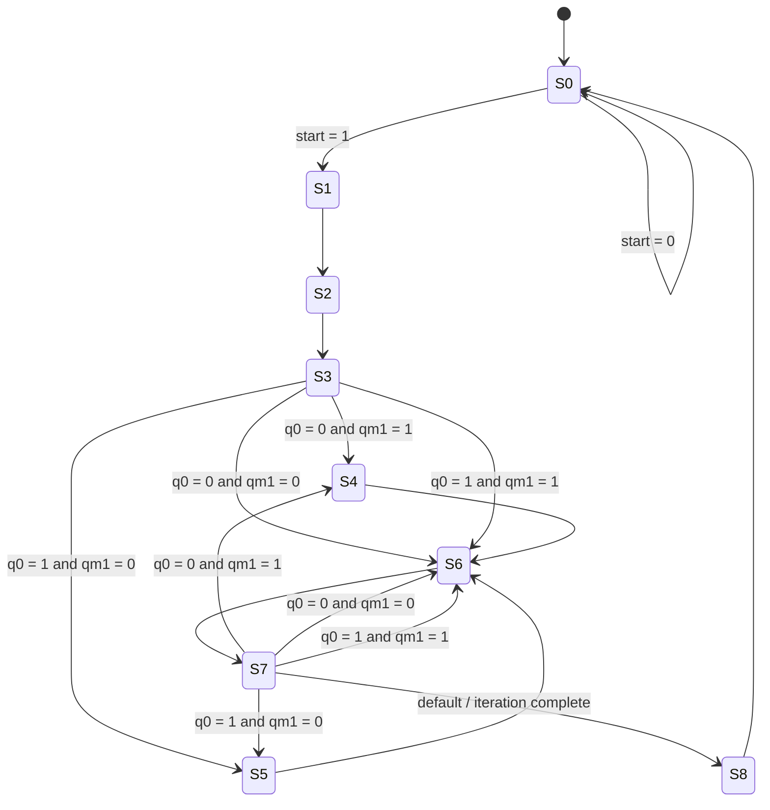

# Booth Multiplier RTL

## Overview

This project implements a 16-bit Booth multiplier in Verilog as a synthesizable RTL design derived from the NPTEL course "Hardware Modeling using Verilog". The architecture here is an improved version that keeps the original algorithmic intent while removing simulation-only hazards and latch-prone control logic.

The key improvements are:
- Removal of all artificial intra-assignment delays (#)
- Rigorous use of non-blocking assignments (<=) in registered logic
- Default values assigned at the start of each combinational FSM block to avoid latch inference
- Clear separation between the datapath and the control path

## Module Summary

| Module | Type | Description |
| --- | --- | --- |
| BOOTH.v | Top-level RTL | Integrates datapath and controller for the Booth multiplier |
| controller.v | Control path | Implements the FSM and generates control signals |
| modules_datapath.v | Datapath | Contains shift registers, ALU, PIPO, QM1, and counter |
| testbench.v | Verification | Provides a simple stimulus bench for simulation |

## Top-Level Interface

| Signal | Direction | Width | Description |
| --- | --- | --- | --- |
| ldA | input | 1 | Load A register |
| ldQ | input | 1 | Load Q register |
| ldM | input | 1 | Load multiplicand register M |
| clrA | input | 1 | Clear A register |
| clrQ | input | 1 | Clear Q register |
| clrff | input | 1 | Clear QM1 flip-flop |
| sftA | input | 1 | Shift A register |
| sftQ | input | 1 | Shift Q register |
| addsub | input | 1 | Select ALU add or subtract |
| decr | input | 1 | Decrement iteration counter |
| ldcnt | input | 1 | Load counter preset |
| data_in | input | 16 | Multiplier / multiplicand operand |
| clk | input | 1 | Active clock |
| qm1 | output | 1 | Previous bit of Q |
| eqz | output | 1 | Counter zero flag |
| q0 | output | 1 | Current LSB of Q |

## Datapath Architecture

```mermaid
flowchart LR
    IN["data_in[15:0]"] --> QREG["Q Shift Register"]
    IN --> MREG["M PIPO Register"]
    AREG["A Shift Register"] -->|A[15]| ALU["ALU"]
    MREG -->|M| ALU
    ALU -->|Z| AREG
    QREG -->|Q[0]| QM1["QM1 FF"]
    QREG -->|Q[0]| CTRL["Controller"]
    QM1 -->|qm1| CTRL
    CNT["Counter"] -->|eqz| CTRL

    CTRL -->|ldA / sftA / clrA| AREG
    CTRL -->|ldQ / sftQ / clrQ| QREG
    CTRL -->|ldM| MREG
    CTRL -->|ldcnt / decr| CNT
    CTRL -->|addsub| ALU
```

This datapath shows the main data flow used by Booth multiplication:
- A and Q operate as right-shifting registers during the iterative algorithm.
- QM1 stores the previous least-significant bit of Q to decide the action.
- M is loaded as the multiplicand operand and fed into the ALU.
- The ALU produces the updated accumulator value that is routed back to A.
- The counter tracks the number of Booth iterations and drives eqz.

## Control Path and FSM



The FSM follows the Booth decision table:
- If the pair (q0, qm1) is `01`, the accumulator is updated by adding M.
- If the pair is `10`, the accumulator is updated by subtracting M.
- If the pair is `00` or `11`, no arithmetic update is required.
- The loop continues while the counter has not reached the completion condition.
- `eqz` is used to detect when the remaining iterations are complete.

## Design Notes

This implementation is intentionally different from the original course example in the following ways:
- The arithmetic core remains faithful to Booth's algorithm, but the control logic is safer for synthesis.
- Default assignments at the start of the combinational FSM block avoid implicit latch inference.
- All register updates are synchronous and use non-blocking assignments, which eliminates race conditions that are common in simpler blocking-assignment examples.
- The top-level RTL is organized and documented for readability and portability to ASIC or FPGA flow tools.

## Verification

The included testbench drives a simple signed multiplication sequence and dumps waveforms for debugging. It is intended to be compiled and simulated with a Verilog simulator such as Icarus Verilog.
